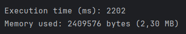
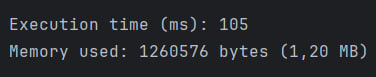
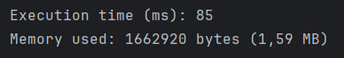

# Harry Potter Refactored
## Lab 3: Speed Optimization

---

## Changes:

- **Replaced `TreeMap` with `HashMap`** for faster access and insertion.
- **Replaced `BufferedReader` with `Files.lines()` stream** for faster reading, even though it uses slightly more memory.
- **Kept word frequency counting via `merge(word, 1, Integer::sum)`**.
- **`toLowerCase(Locale.ROOT)` applied directly during line reading.**
- **Streamlined top-30 selection using `stream().sorted(...).limit(30)`**.

## Results:
**Before:** 
  
**After Memory Fix:** 
  
**After Speed fix:** 

